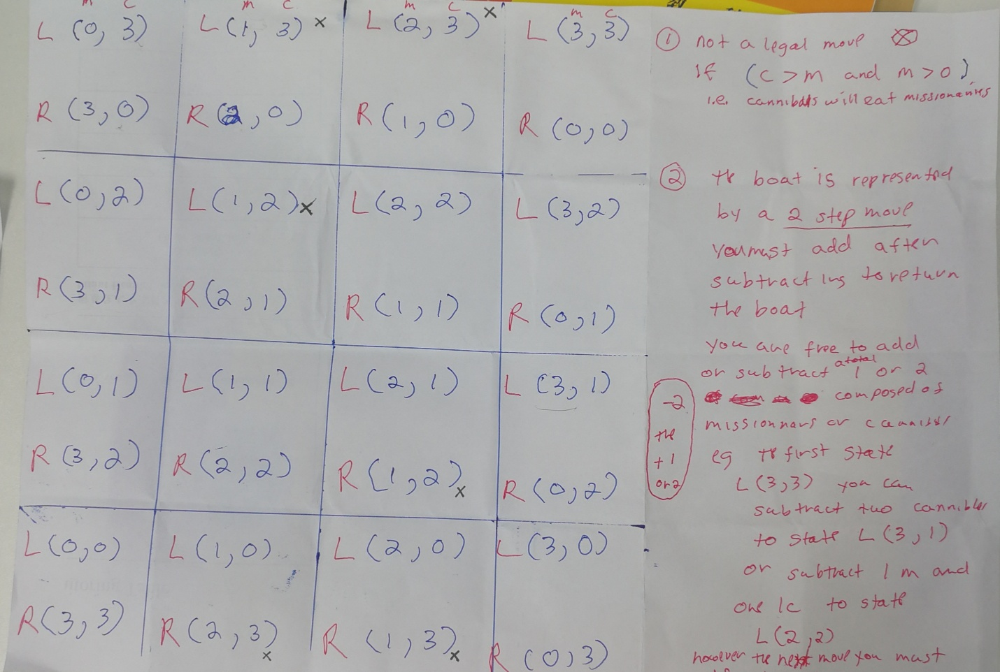

# Missionaries and Cannibals

a graphing solution

and interactive play

a place to hold some code for a python implementation of M and C

I started working on it after reading Melanie Mitchell's book artifical Intelligence

It is an example of the symbolic AI I used to do in the 90's

I thought of soloving it by graphing all states of the left and right bank

the Cannibals increace on the left bank along the y axis

and the Missionaries increace along the x axis

the boat could be modeled  a two step process

First  subtracting to move from the left bank to the right 

Second adding one or two to return the boat

